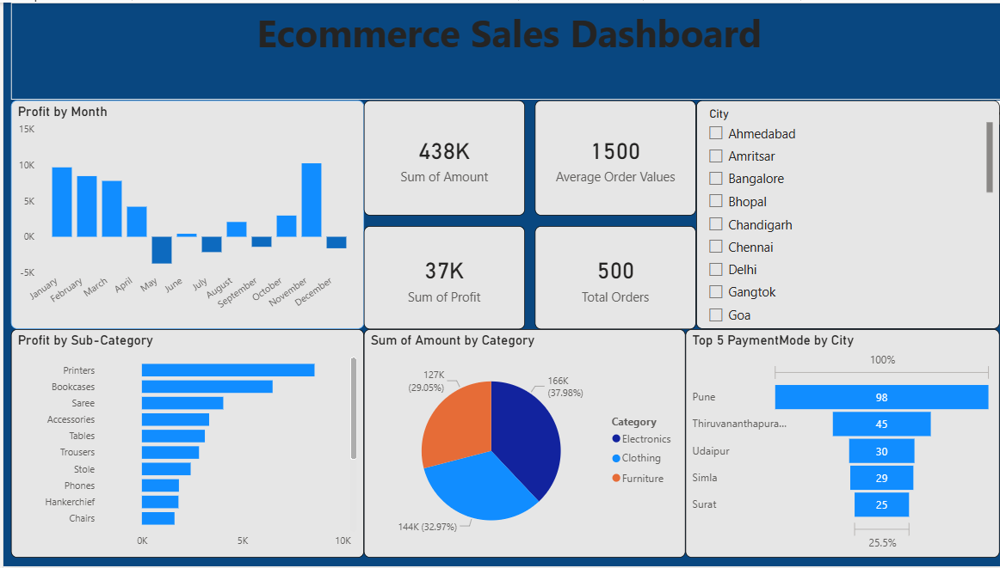

Ecommerce Sales Analysis using Power BI
# 📊 Ecommerce Sales Dashboard

## 🔍 Project Overview
This project analyzes ecommerce sales data to identify revenue trends, top-performing products, and regional performance using Power BI.
---

## 🎯 Objective
- Analyze total sales and profit
- Identify Top 5 products
- Track regional performance
- Monitor category-wise revenue
- Generate business insights
---

## 🛠 Tools Used
- Microsoft Power BI Desktop
- DAX (Data Analysis Expressions)
- Excel / CSV Dataset
---

## 📈 Key KPIs
- Total Sales
- Total Profit
- Profit Margin
- Total Orders
- Top Performing Products
---

## 📷 Dashboard Preview

---

## 📂 Files Included
- Ecommerce Sales Dashboard.pbix
- ecommerce_sales_data.csv
- EcommerceSalesDashboard.png

---

## 🚀 Business Insights
- Identified highest revenue generating products
- Analyzed region-wise sales performance
- Compared profit margin across categories
- Evaluated overall sales trends
